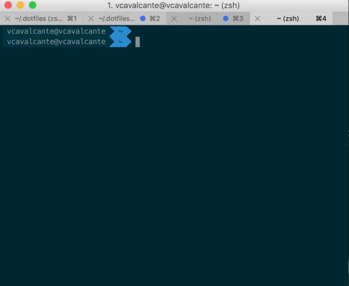

# Victor Cavalcante dotfile

* Eu mantenho este repositório como *meu* dotfiles, mas você pode usar como se fosse seu. :)
* Fique a vontade em mandar sugestões, mas só vou aceitar pull requests se realmente tiver valor para o meu dia a dia.
* Se você estiver iniciando pode considerar forcar o dotfiles do [mathias](https://github.com/mathiasbynens/dotfiles/) ou [alrra](https://github.com/alrra/dotfiles/) ou [paulirish](https://github.com/paulirish/dotfiles) (no qual me baseei)

## Setup
#### Instalação e uso

* forque este repositório por sua conta e risco (que medo)
* clone o repositório
* *leia* o manual abaixo de como faço o meu Setup
* be happy :)

# Setup do Mac OS X

Troquei muito rápido de macbooks em muito pouco tempo, já tive um macbook air, que não me atendeu, vendi e comprei um macbook pro do modelo antigo, também não me atendeu, pois, ainda usava na maior parte do tempo o Parallels e ele não bancava muito bem, por fim tenho o macbook pro retina que é mais que o suficiente para o que eu faço, e além disso o computador que uso na empresa também é um macbook pro retina. 

Bom, dá para imaginar que já tive que configurar várias vezes as mesmas coisas, e como usuário recente de Mac OS X tive que entender como funciona as configurações, e para quem vem de Windows a diferença é gritante, procurei muito como fazer isso de forma eficiente, até que achei o [Setup do loopinfinito](http://setup.loopinfinito.com.br) e olhando os setups, percebi que o [setup do Eduardo Shiota](http://setup.loopinfinito.com.br/eduardo-shiota/) e do [Zeno Rocha](http://setup.loopinfinito.com.br/zeno-rocha/) tinham em comum um tal de Dotfiles, que eu não tinha ideia do que era, pesquisei bastante, fiz bastante besteira, mas consegui entender e vou escrever esse documento para que me ajude em um novo setup e possa ajudar outras pessoas que estão com o mesmo problema que tive lá atras.

## O que são os Dotfiles?

Dotfiles nada mais são do que arquivos que começam com ".", por isso o nome, a maioria dos software no mac e no linux guardam suas configurações em arquivos e por convenção começam com "." (esses arquivos são ocultos).

A ideia é que você possa guardar esses arquivos e restaurar na sua nova máquina e vai ter de volta as configurações que você já estava acostumado, mas os Dotfiles sozinhos não fazem mágica, por isso escrevi esse manual, além deles vamos usar scripts shell para automatizar algumas coisas, brew para instalar software, e outras coisinhas a mais.

## 1. Atualize seu Mac OS X

Garanta que está tudo atualizado.


## 2. Instale o [Xcode](https://developer.apple.com/xcode/) e o ["Command Line Tools"](https://developer.apple.com/downloads/index.action)

1. Vá até a App Store e install Xcode.
2. Abra e aceite os termos
3. Então vá ate o terminal e instale "Command Line Tools":

```sh
  xcode-select --install
```

## 3. Instale os Dotfiles

Visite o [meu repositório Dotfiles ](https://github.com/vcavalcante/dotfiles) e forque para o seu github, isso é muito importante, pois você irá fazer modificações nesses arquivos e a ideia é que você guarde no seu github para quando precisar recuperar.

Clone o repositório para o direto ~/.dotfiles

```sh
git clone https://github.com/vcavalcante/dotfiles.git ~/.dotfiles
```

Agora temos todos os arquivos necessários no computador mas ainda não está no lugar correto, e aqui é que vem o pulo do gato, depois de termos baixado o que falta, iremos criar um link simbolico desses arquivos que estão no .dotfiles para a raiz do seu usuário (~/). Assim podemos manter esses arquivos serparados um diretório que está dentro do repositório git.

Mas antes vamos instalar algumas coisas:

## 4. Instalando os Softwares

Tento instalar tudo via Homebrew ou Brew Cask, enquanto o [Homebrew project](http://brew.sh/) é um projeto que foi desenvolvido para gerenciar pacotes para o Mac OS X, o Brew Cask é uma extensão desse mesmo projeto que permite instalação de aplicações gráficas, como Browsers, IDEs e tudo mais.

Primeiro verifique se o brew já está instalado se não estiver, instale:

```sh
/usr/bin/ruby -e "$(curl -fsSL https://raw.githubusercontent.com/Homebrew/install/master/install)"
```

Temos 2 scripts dentro do repositório para realizar as instalações dos softwares, são eles:

* brew.sh
* brew-cask.sh

Execute cada um deles separadamente

```sh
./brew.sh
./brew-cask.sh
```

### O que está incluso?

### HomeBrew

* [CoreUtils](https://pt.wikipedia.org/wiki/GNU_Core_Utilities)
* [MoreUtils](https://joeyh.name/code/moreutils/)
* [FindUtils](https://www.gnu.org/software/findutils/)
* [Gnu-sed](https://www.gnu.org/software/sed/)
* [Bash](https://www.gnu.org/software/bash/)
* [grc](http://korpus.juls.savba.sk/~garabik/software/grc.html)
* [wget](https://www.gnu.org/software/wget/)
* [vim](http://www.vim.org/)
* [grep](https://www.gnu.org/software/grep/)
* [screen](https://www.gnu.org/software/screen)
* [Entr](http://entrproject.org/)
* [gh](https://github.com/jingweno/gh)
* [mtr](https://www.bitwizard.nl/mtr/)
* [sift](https://sift-tool.org/)
* [git](https://git-scm.com/)
* [imagemagick](https://www.imagemagick.org/script/index.php)
* [node](https://nodejs.org/)
* [pv](https://www.ivarch.com/programs/pv.shtml)
* [rename](http://plasmasturm.org/code/rename/)
* [tree](http://mama.indstate.edu/users/ice/tree/)
* [zopfli](https://github.com/google/zopfli)
* [ffmpeg](https://ffmpeg.org/)
* [wifi-password](https://github.com/rauchg/wifi-password)
* [terminal-notifier](https://github.com/julienXX/terminal-notifier)
* [httpie](https://httpie.org/)
* [Android-platform-tool](https://developer.android.com/sdk)
* [pidcat](https://github.com/JakeWharton/pidcat)
* [zsh](http://www.zsh.org/)
* [fish](https://fishshell.com)
* [nvm](https://github.com/creationix/nvm)
* [dotnet](https://www.microsoft.com/net/core#macos)
* [z](https://github.com/rupa/z)

### Brew Cask

#### Uso diário

* [1Password](https://1password.com/)
* [dropbox](http://dropbox.com)
* [Teams] Microsoft Teams

#### Browser

* [Chrome](https://www.google.com/intl/en/chrome/browser/)
* [Firefox](https://www.firefox.com)
* [Brave](https://www.brave.com)

#### Development

* [Sublime Text](http://www.sublimetext.com/) 
* [iTerm 2](http://www.iterm2.com/#/section/home) 
* [Source Tree](http://www.sourcetreeapp.com/) 
* [imagealpha](https://pngmini.com/)
* [imageoptim](https://imageoptim.com/)
* [visual-studio-code](https://code.visualstudio.com/)
* [Parallels desktop](https://parallels.com)

#### Browsers 

* [google-chrome-canary](https://www.google.com/chrome/browser/canary.html?platform=mac)
* [firefoxnightly](https://nightly.mozilla.org)
* [webkit-nightly](https://webkit.org/downloads/)
* [chromium](https://www.chromium.org/Home)
* [torbrowser](https://www.torproject.org/projects/torbrowser.html)

#### Other

* [disk-inventory-x](http://www.derlien.com)
* [vlc](https://www.videolan.org/vlc/)
* [gpgtools](https://gpgtools.org)
* [licecap](http://www.cockos.com/licecap/)
* [utorrent](http://www.utorrent.com/intl/en/)
* [alfred](https://www.alfredapp.com)
* [Skype](http://www.skype.com/en/)
* [Spotify](https://www.spotify.com)
* [uTorrent](http://www.utorrent.com/)
* [lastpass](https://lastpass.com)
* [caffeine](http://lightheadsw.com/caffeine/)
* [dash](https://kapeli.com/dash)
* [Evernote](http://evernote.com/) 


## 5. Instale otras coisinhas

[Trash-cli](https://www.npmjs.com/package/trash-cli) (já me ferrei dando rm em arquivo errado)

```sh
npm install --global trash-cli
```

[z](github.com/rupa/z) isso é mágico, ahhh como eu <3 o z

```sh
git clone https://github.com/rupa/z.git ~/code/z
chmod +x ~/code/z/z.sh
```

## 6. Configure o git

### Gere SSH keys para GitHub
Visite o [Guia oficial do GitHub](https://help.github.com/articles/generating-ssh-keys#platform-mac) para instruções.

### Configure o usuário de commit

```sh
git config --global user.name "Victor Cavalcante"
git config --global user.email victor@cavalcante.net
```

## 7 Configurações do Mac OS X

Eu me inspirei no dotfiles do PaulIrish, que se inspirou no do mathias. A ideia é ter um script que set todas as configurações que você gosta do Mac, tem de tudo nesse arquivo, eu ajustei para as minhas necessidades você deve olhar e arrumar para as suas.

```sh
sh ~/.dotfiles/.osx
```

## 8. Configure o shell padrão para o ZSH e instale o OH-My-ZSH

Quanto estava usando Windows sempre quis usar um terminal elegante, bonito e prático. Testei alguns, comecei com o bash, depois fui para o fish e finalmente caí no zsh, foi o que mais gostei, ainda mais quando descobri o Oh My ZSH, que é um conjunto de configurações e plugins/temas, que facilitam muito o uso.

Primeiro sete o zsh como shell padrão

```sh
chsh -s /bin/zsh
```

Depois instale o Oh-My-ZSH
```sh
sh -c "$(curl -fsSL https://raw.githubusercontent.com/robbyrussell/oh-my-zsh/master/tools/install.sh)"
```

Instale as fonts do powerline

```sh
cp ~/.dotfiles/fonts/. /Library/Fonts/
```

Para ficar bonito precisa ajustar o tema do iTerm para usar o tema solarized dark e a fonte do powerline

1. iTerm2 -> Preferences
2. Profiles 
3. Colors
4. Color Presets... -> Selecione Solarized Dark
5. Ainda em Profiles selecione Text
6. Mude a font para Mezlo LG M DZ for powerline

Para finalizar a configuração do terminal é necessário linkar os dotfiles que estão do diretório `~/.dotfiles` para o diretório `~/`, para isso execute o commando abaixo:

```sh
cd ~/.dotfiles
~/.dotfiles/symlink-setup.sh
```

Após realizar essa configuração deverá fechar o iTerm2 e abrir novamente. Seu terminal deve estar como a imagem abaixo:



## 9. Configure o [Chrome Canary](https://www.google.com/intl/en/chrome/browser/canary.html) como browser Default.

1. Abra System Preferences
2. General ➜ Default Web Browser
3. Selecione “Chrome Canary” from the drop-down menu


## 10. Configurar os workflows do [Alfred](http://alfredapp.com) 

Visite [minha coleção de workflows do Alfred](https://github.com/vcavalcante/alfred-workflows) para ver se gosta, se gostar, é só clonar e abrir cada arquivo no alfred, isso já instalará cada um dos wokflows.

## 11. Configure o usuário do [NPM](http://npmjs.org)

```sh
npm adduser vcavalcante
```

## 12. Trabalhe feliz!

:)

